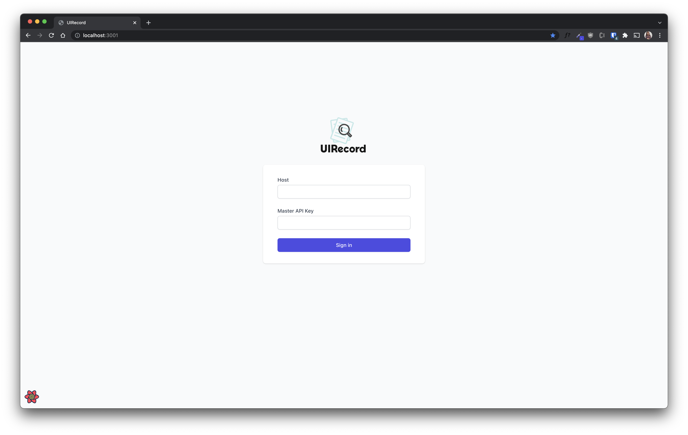
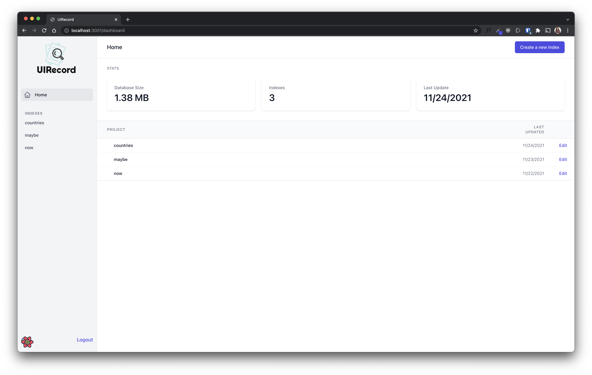
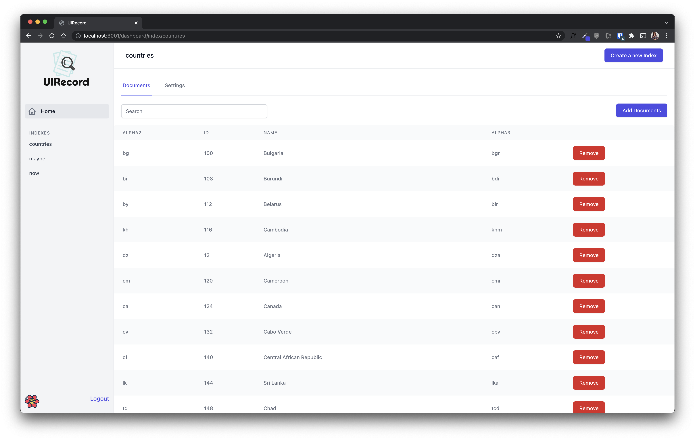
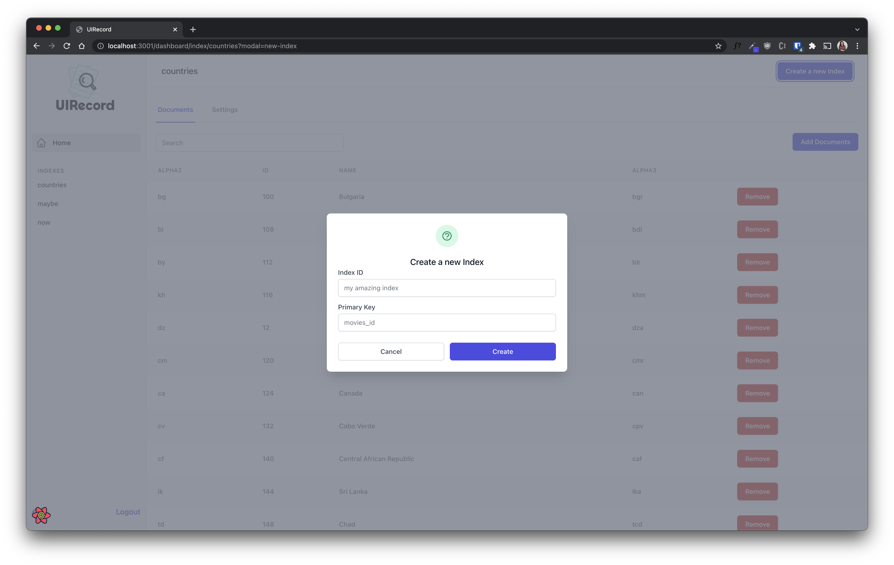

# UIRecord

## A UI for managing your [meilisearch](https://www.meilisearch.com/) instances


---

<details>
  <summary>Screenshots</summary>




</details>

## Features

- ✨ Create new indexes
- 🔦 Search within your indexes
- 📜 Add Documents to any index
- ⚙️ Change all index settings
- ☁️ Use hosted version or deploy your own
- 🔒 No data is stored outside your browser

## Using your data

* Login using your [master key](https://docs.meilisearch.com/reference/api/keys.html#keys). From this moment on only your private key will be used to make API calls.
* The URL of your [meilisearch](https://www.meilisearch.com/) instance


## Run Locally:

```sh
git clone git@github.com:SaraVieira/uirecord.git
cd uirecord
yarn dev #npm run dev
```

# Roadmap:

Please check issues

## Built with

- NextJS
- Tailwind
- React Query

## License

MIT
